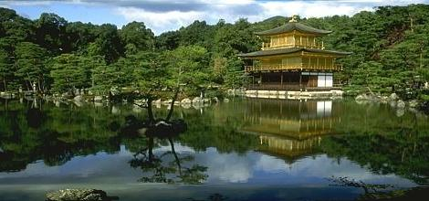

# Content-Aware-Image-Resizing
Seam Carving Algorithm for content aware image resizing and object removal

## Importance/Cost Matrix
two types of cost functions are implemented
-  computes image gradient as cost
-  computes cost as per pixel entropy considering 9-by-9 neighbourhood

| original image | gradient cost |
| -- | -- |
|  |  |
|  |  |

## Image Downsizing
-  does reduction in width using seam carving
- results below are for gradient cost matrix

| original width : 1428 pixels | reduced width : 1128 pixels | reduced width : 714 pixels | reduced width : 476 pixels |
| -- | -- | -- | -- |
|  |  |  |  |

- per pixel entropy generally works better than gradient but it is computationally expensive

| original width : 470 pixels | gradient cost, reduced width : 235 pixels | entropy cost, reduced width : 235 pixels |
| -- | -- | -- |
|  |  |  |

## Image Upsizing
-  does increment in width using seam carving
- if width is to be increased by `x` pixels, then width is reduced by `x` pixels first using normal seam carving and the deleted seams are duplicated in original image to get the resultant image with width increased by `x` pixels

| original width : 1428 pixels | increased width : 2142 pixels |
| -- | -- |
|  |  |

| original width : 464 pixels | increased width : 696 pixels |
| -- | -- |
|  |  |

| original width : 520 pixels | increased width : 2128 pixels |
| -- | -- |
|  |  |

## Object Removal
-  resize the image in such a way that specific object in the image is removed smoothly
- bounding box over the object is given and the cost values of the pixels in the bounding box are made negative infinite to make every seam pass through the object

| original | object removed |
| -- | -- |
|  |  |

| original | object removed |
| -- | -- |
|  |  |
